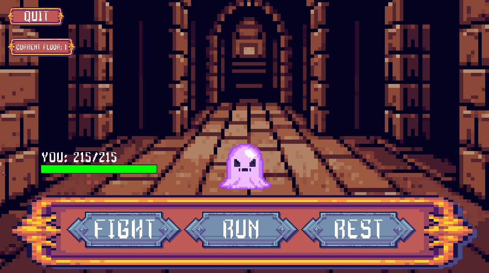
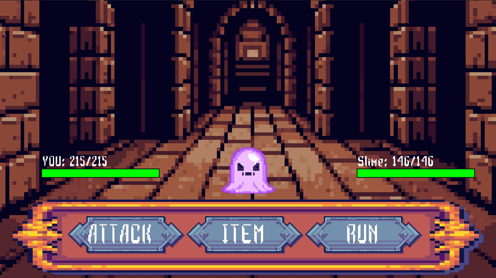

# COMP3016 CW1

## Gameplay Description
This is an RPG game where you enter a dungeon and try to beat the dragon on the final floor.
First you create a character by choosing a class and allocating the stat points given to you.
Next you enter the dungeon and an enemy will approach. You can either fight, run or rest. Running will mean you avoid the enemy but have a chance to take damage, resting means you heal to full health and fight means you will enter combat.
If you enter combat you will be able to either attack the enemy or run. Run will give you a chance to escape the encounter but if you fail you take a hit of damage from the enemy. Attack will make you hit the enemy.
If you defeat the enemy you will gain xp and when you level up you will be given stat points that you can allocate to your different stats.
To beat the game you must defeat the dragon on the last floor of the dungeon

## Dependencies used
SDL3, SDL3_image and SDL3_tff

## Use of AI
I have used AI to generate the sprites for the enemies, the background image once the player has entered the dungeon and the image of the campfire shown when resting.
I have also used it for debugging code when videos or searching on websites have not worked. An example of this is when I was making the FadeTransition function as there was little information on how to do it and the problems I found when making it.
I also used it to optimise some parts of my code and help create an animated healthbar.

## Game programming patterns used
Game loop - The game gets user input and updates the game according to what buttons the user presses
Update method - All the game objects are updated using an update loop that runs 60 times per second
OOP - The GUI elements and Entities are all made in classes. The GUI elements all inherit from the UIObject class and the Enemy and PLayer class inherit from the Entity class

## Game mechanics
When you create a character the character will have certain base stats. The player can allocate 4 points during character creation but stats cannot go below what they were originally. This is done by making a struct that saves the original stats before the player made any changes.
When the player enters the dungeon they will be on floor 1. Each floor has a selection of 3 enemies that randomly spawn. The weakest has a 50% chance, the next strongest has a 30% chance and the strongest enemy on the floor has a 20% chance of spawning.
When the player completes 7 actions of either fighting, running or resting they can go to the next floor which will share the two strongest monsters of the previous floor and will have one new stronger monster.
When fighting the player always goes first. 
During combat you can also land critical hits and dodges. The chances of these are based on the stat points they have put into agility and luck. Agility increases the dodge chance and luck increases the critical hit rate. Critical hits deal x1.7 more damage

## Sample Screens
### Choose Class

### Allocate Points

### Approached By Enemy

### Fight Enemy

## Evaluation
I have managed to create a turn-based RPG using SDL3. I was able to implement SDL_tff to display text and SDL_image to show images to the player.
I have implemented OOP into the project by creating classes, using inheritance and encapsulation.
I have managed game scenes by creating each scene as a separate function and by stopping the update loop the game automatically returns to the previous scene.
I have added a scene transition by creating a black square that fades in and out.

If i did this again I would create it using SDL2 instead of SDL3. This is because when I wanted to add audio into the project towards the end I was unable to. This is because although SDL3_mixer exists there are no binary files to make it work with SDL3 and SDL2_mixer is not compatible with SDL3. This would also mean I could use the options button to give the player control over how loud the audio is.
Something else I would do differently would be to create scenes as classes instead. This would make it easier to navigate the code as it could be split into many cpp files.
I would also make the item button in combat usable. Because I ran out of time towards the end this was a feature I had to drop but knowing what I do now it would not take as long to reach this point again and I would have the time to implement this.

